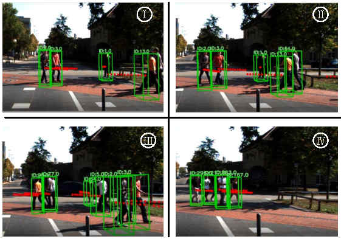
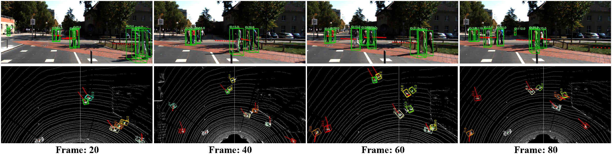

# A Perception-Prediction System Based on 3D Point Clouds
### Abstract: This project is using the point clouds data to perception surrounding environment and predict the trajectories of obstacles.

Perceiving the moving obstacles and predicting their trajectories play an important role in ensuring the safety of robots. Although some novel methods have been proposed, both the flexibility and the real-time performance need to be further improved. This paper designs a real-time and flexible perception-prediction system to perceive the obstacle and predict trajectories based on 3D point clouds. A trajectory data set is created by utilizing raw point clouds data. To guarantee the flexibility of the proposed system, five replaceable functional modules are provided by using the modular design approach. The real-time property is ensured by combining some modules with less computation, and a compensation scheme is designed to achieve a satisfying perceiving result. Additionally, spline interpolation and Gaussian filtering are integrated into the proposed system to enhance the prediction accuracy. Finally, experiments are provided to validate the proposed perceiving and prediction system.

### The struction of system:

### Some of the result of system:

